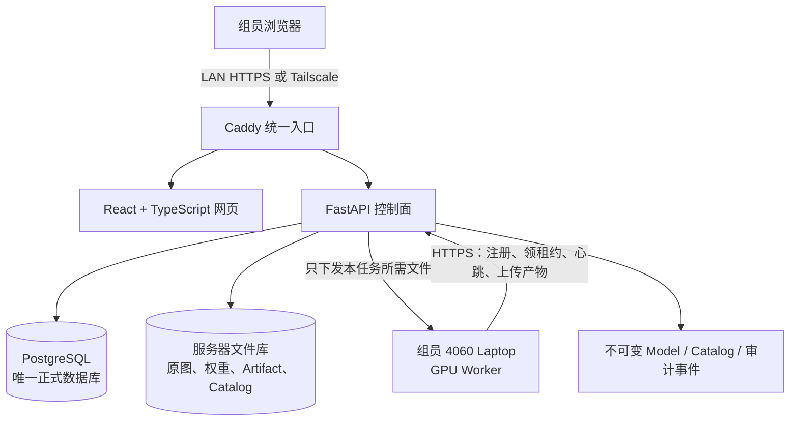

# 中华白海豚识别归档系统：架构与组员协作指南

> 面向项目组成员的快速说明，更新于 2026-08-31。本文是架构总览，不替代 [PLAN.md](../PLAN.md) 与 M1–M5 详细设计；详细规则仍以原文为准。

## 1. 项目要解决什么问题

系统接收一次调查产生的整批图片，而不是要求用户逐张上传。处理分为两轮：

1. **批内归档**：检测一张图中的所有背鳍，提取特征，将本批次照片按候选个体聚类，并选出代表图。
2. **历史匹配**：把批内候选个体与服务器的历史个体目录比较，返回 Top-K 候选，交给人工独立审核。

模型只提供 Candidate（候选），不能自动确认个体、自动合并身份或确认亲缘关系。关联既有身份必须由 3 名审核人选择同一个 UUID；身份合并、拆分或撤回也必须 3 人对同一不可变方案全部同意。任何分歧都进入冲突状态，现有身份不变。

## 2. 一句话架构

**Ubuntu 服务器是唯一事实源和网页入口；组员的 RTX 4060 Laptop 是按需 GPU Worker，只负责训练或推理，不保存正式数据库。**



这里的“服务器”不承担 GPU 训练。它负责权限、数据版本、任务调度、产物校验、人工审核和正式目录发布；算力来自组员电脑。

## 3. 各组件职责

| 组件 | 当前技术 | 主要职责 | 明确不做什么 |
|---|---|---|---|
| Web | React、TypeScript、Vite | 文件夹上传、任务进度、审核、个体库可视化、模型与系统管理 | 不直接访问数据库，不自行裁决身份 |
| API / 控制面 | FastAPI | 登录与角色、上传、Job 租约、审核规则、Catalog/Model 门禁、查询与审计 | 不在服务器本机训练模型 |
| 正式数据库 | PostgreSQL 16 | 保存 Batch、Image、Crop、身份、审核票、Job、模型和版本指针 | 不向浏览器或 Worker 暴露端口 |
| 文件库 | 服务器目录 | 保存原图、Crop、权重、Embedding、Faiss、训练与查询产物 | 大文件不提交 Git |
| GPU Worker | Python、PyTorch、YOLO、Re-ID、HDBSCAN | 批内归档、查询推理、训练、固定评估、Catalog 重建 | 不复制正式数据库，不决定正式身份 |
| 统一入口 | Caddy | 提供 HTTPS、静态前端、反向代理 API | 正式协作时不暴露 Vite 5173 或 API 8000 |
| 组网 | 局域网、Tailscale Serve | 让组员在内网或 tailnet 访问服务器 | 第一阶段不使用公网 Funnel 或 `.top` 公网域名 |
| 自动部署 | Git、systemd timer、Docker Compose | 每 3 分钟检查管理员指定的远端分支，构建、迁移、就绪检查、失败回退 | 不自动合并分支，不部署未通过门禁的版本 |

## 4. 组员电脑是否需要数据库

**不需要。** 推荐且已经实现的方式是：

1. 服务器管理员在网页生成一次性 Worker 登记码。
2. 组员电脑登记后得到设备令牌，令牌文件只保存在本机。
3. Worker 通过 HTTPS 领取一个带有效期的任务租约。
4. 服务器只允许它下载该任务清单中的图片、Crop 或权重；Worker 下载后复验 SHA-256。
5. Worker 在本机 GPU 上计算，将带模型版本、数据版本和哈希的产物上传。
6. 服务器重新校验产物，再写入正式数据库并进入人工审核。

这样不会出现“每个人有一份数据库，最后不知道哪份是真的”的问题，也能避免组员误改正式身份。网络中断时任务不会被错误提交；租约过期后服务器可以安全重派，旧 Worker 的迟到产物会被拒绝。

## 5. 核心业务流程

### 5.1 整批上传与批内第一次归档

```text
上传原始文件夹
→ 浏览器流式计算 SHA-256，32 MiB 分片续传
→ 服务器建立不可变 Manifest 并登记 Batch / Image
→ 创建 batch_archival Job
→ 4060 Worker：N 目标检测 → Crop → Embedding → HDBSCAN 聚类
→ 服务器校验 Artifact、模型协议和 Embedding 行绑定
→ 生成批内候选簇、代表图和审核任务
```

标准 iDolphin 文件夹和普通图片文件夹都可以上传。原文件夹里的数字子目录只作为“本批次来源分组”，绝不能直接当作跨批次的全局个体 ID。

### 5.2 与历史库比较的第二次归档

```text
审核可用的批内候选簇
→ 服务器在任务创建时固定的 active Catalog 上计算 Faiss Top-K
→ 3 名审核人独立盲审 Existing / New / Uncertain
→ Existing 需 3 人选择同一 UUID；New 至少 2 票
→ 服务器按固定规则投影正式 Observation / Individual
→ 构建 staged Catalog
→ 摘要、行序、模型、维度和索引全部通过后才能激活
```

Worker 不能上传“这是谁”的最终结论。历史 Top-K 必须由服务器使用不可变 Catalog 重新计算，防止不同成员电脑上的图库或阈值不一致。低置信度只能解释为“疑似新个体”，不能自动创建或合并身份。

### 5.3 单图、多图或文件夹查询

查询和归档共用上传与租约机制：

```text
单图 / 多图 / 文件夹
→ query_inference Job
→ Worker 完成多目标检测和 Embedding
→ 服务器验证 manifest.json + embeddings.npy
→ 在固定 Catalog 上查询 Top-K
→ 网页显示候选、分数、支持帧、侧别、质量和版本
```

查询结果始终标记为 `candidate_only`，不会直接写入正式身份。一次图片含多只海豚时会保留 N 个 Crop，而不是只取一个主目标。

### 5.4 训练、评估与模型上线

```text
服务器冻结 Dataset Version 和 train/val/calibration/test
→ GPU Worker 领取训练租约
→ 本机训练并持续上传 Checkpoint
→ 服务器登记权重与训练血缘
→ Worker 领取固定 Evaluation Job
→ 服务器核验评估、阈值和与现网模型的比较
→ Reviewer 发起上线
→ Re-ID 模型先重建并激活兼容 Catalog，再切换 Production
```

服务器不会把固定 test 数据发给训练任务。Sequence、Encounter、近重复组和同一原图派生 Crop 不得跨 Split。权重保存在 Worker 本机或服务器文件库，不进入 Git。

### 5.5 多目标、同框与关系

一张图片中的多个背鳍会形成共现证据。系统只允许表达 `co_occurrence`、`repeated_association` 或 `suspected_kinship` 等研究候选，并始终遵守：

- 同框不等于亲缘；
- 算法结果不等于关系结论；
- 多目标真实性由 3 人盲审，至少 2 人确认后才成为有效成员；
- 身份更正保留完整历史，不物理删除旧记录。

## 6. 主要数据对象

| 对象 | 含义 |
|---|---|
| Batch / Image | 一次调查批次及其不可变图片清单 |
| Crop | 从图片中检测出的一个背鳍目标；一图可以有多个 Crop |
| Candidate Cluster | 批内聚类形成的候选个体组，不是正式身份 |
| Review Task / Vote | 固定审核人名单、独立票据和服务器裁决结果 |
| Confirmed Individual | 经规则确认的全局个体 UUID |
| Observation | 某个 Crop 在某个时间点与正式个体的可追溯关联 |
| Dataset Version | 训练数据成员、标签来源和 Split 的不可变快照 |
| Job / Attempt / Artifact | 任务、每次租约执行及其带哈希产物 |
| Model Version | 权重、配置、训练数据、指标、阈值及生命周期状态 |
| Catalog Version | 某时刻正式个体目录与 Faiss 索引的不可变快照 |
| Audit / Identity Event | 登录、下载、审核、发布以及身份更正的追加式历史 |

关键约束是：同一时刻只有一个 active Catalog；一个 Catalog 中一个 Crop 最多属于一个正式个体；已经发布的 Artifact、Catalog 和审计事件不可原地改写。

## 7. 权限分工

| 角色 | 典型权限 |
|---|---|
| admin | 用户和 Worker 管理、部署状态、设备撤销、系统审计、一次性登记码 |
| operator | 上传批次、创建归档/查询/训练任务、查看运行进度 |
| reviewer | 独立审核，发起身份更正以及 Catalog/Model 上线或回滚提案 |
| Worker device | 仅凭设备令牌领取符合能力与显存要求的租约，访问本任务文件并上传产物 |

Tailscale 只解决网络可达性，不代替网页账号、角色和 CSRF 保护。

## 8. 网络与部署

### 8.1 当前开发实例

| 项目 | 当前地址或位置 |
|---|---|
| React/Vite | `http://127.0.0.1:5173` |
| FastAPI | `http://127.0.0.1:8000` |
| 开发数据库 | 容器 `whitewhale-platform-test-postgres` 中的 `whitewhale_dev` |
| 开发文件库 | `/home/cancade/.local/share/whitewhale-dev/data` |

这些端口是本机开发入口，不是最终给组员使用的正式地址。

### 8.2 目标协作入口

正式 Compose 中，浏览器统一访问 Caddy：局域网使用管理员配置的 HTTPS 站点，Tailscale 成员使用 `https://<机器名>.<tailnet>.ts.net`。Caddy 将 `/api/*`、`/health` 和 `/ready` 转给 FastAPI，其余请求返回构建后的 React 页面。PostgreSQL 只存在于 Compose 内部网络。

服务器管理员可以在 `/etc/whitewhale/deploy.env` 修改 `DEPLOY_BRANCH`。三分钟定时任务只会 fetch 并部署该分支的新 commit：在独立 release 中构建、检查非破坏性 Migration、切换软链接并验证 `/ready`；失败时恢复上一版本。组员只负责在自己负责的分支开发和 push，是否部署由管理员选择分支决定。

### 8.3 当前尚未完成的外部配置

- `whitewhale-deploy.timer` 与 `whitewhale-ready.timer` 尚未在宿主机正式安装，因此当前还不会每 3 分钟自动拉取。
- Tailscale 守护进程在线，但 tailnet 管理员尚未在控制台启用 Serve。
- 当前可继续用 localhost/LAN 开发；不要把 Vite 或 FastAPI 端口直接公开到公网。
- 第一阶段使用 LAN/Tailscale 的稳定 HTTPS 地址，不购买或公开 `.top` 域名，也不启用 Tailscale Funnel。

## 9. 4060 Laptop Worker 使用方式

管理员先在网页生成 15 分钟有效的一次性登记码。组员在与服务器代码版本一致的仓库中运行：

```bash
python scripts/run_worker.py register \
  --api 'https://服务器地址/' \
  --registration-code '管理员给的一次性登记码' \
  --token-file "$HOME/.config/whitewhale/worker.json" \
  --gpu-model 'RTX 4060 Laptop' \
  --vram-mb 8192 \
  --cuda-version '12.6' \
  --capabilities 'query_inference,batch_archival,reid_training,fixed_evaluation,catalog_rebuild' \
  --model-versions 'r4'

python scripts/run_worker.py run \
  --api 'https://服务器地址/' \
  --token-file "$HOME/.config/whitewhale/worker.json" \
  --detector-weights models/detectors/yolov8n_dorsalfin.pt \
  --reid-checkpoint outputs/metric_learning/r4/best.pt \
  --device cuda
```

若使用 Caddy 内部 CA，两个命令都额外传入 `--ca-file /path/to/caddy-root.crt`。设备令牌不要上传 Git 或发给其他人；电脑丢失或退出项目时请让管理员撤销令牌。

不同任务可登记不同能力。训练 Detector 时还要在 `run` 命令提供本地基础权重 `--detector-training-base /path/to/base.pt`，并在登记能力中加入 `detector_training`。

## 10. 日常协作方式

### 网页使用者

1. 登录网页并上传本次调查文件夹。
2. 等待有相应能力的 Worker 领取任务。
3. 查看批内候选分组，按分配完成独立审核。
4. 在个体库中查看照片、时间、候选匹配和版本来源。

### 算法组员

1. 从 Git 获取服务器当前使用的代码版本，并从组内渠道取得权重。
2. 登记或启动自己的 4060 Worker；不安装、不复制正式 PostgreSQL。
3. 保持 Worker 在线，观察心跳和任务结果；权重、数据和令牌不提交 Git。
4. 算法改动先在分支验证并 push，由服务器管理员选择何时部署。

### 前后端开发组员

1. 在自己的分支开发、测试并 push。
2. 不直接修改服务器数据库、`/srv/whitewhale/data` 或 Production 指针。
3. 把 Migration、接口合同和前端改动放在同一可回退提交中。
4. 通知管理员分支名；自动部署启用后，服务器最多约 3 分钟检测一次新 commit。

### 服务器管理员

1. 选择 `DEPLOY_BRANCH`，安装并检查 systemd timers。
2. 管理平台密钥、PostgreSQL、Caddy CA、Tailscale Serve 和 Worker 登记码。
3. 关注 `/ready`、部署状态、Worker 心跳、磁盘和追加式审计事件。
4. 按需执行一致性导出与隔离恢复演练；第一阶段不设自动备份。

## 11. 仓库目录速览

```text
web/                 React + TypeScript 前端
src/whitewhale/      FastAPI、领域规则、Worker 客户端与算法编排
migrations/          PostgreSQL Alembic Migration
scripts/             数据、Worker、导入、验收等正式入口
deploy/              Caddy、systemd、部署、导出和恢复脚本
docker/              API 与 Web 镜像定义
configs/             算法与数据配置
tests/               后端和领域自动化测试
docs/                分阶段设计、验收证据与本说明
PLAN.md              完整需求、数据模型、安全和验收总设计
```

## 12. 安全与可追溯原则

- 正式数据库只有服务器一份，且 PostgreSQL 不映射到局域网。
- 浏览器写操作要求登录、角色和 CSRF Token；会话 Cookie 使用安全属性。
- 图片、权重、Embedding、Faiss 和 Artifact 都以 UUID、版本和 SHA-256 绑定。
- Worker 只能访问有效租约授权的文件，不能调用人工裁决接口。
- 审核、Catalog/Model 切换和身份更正记录追加式事件；审计表拒绝 UPDATE/DELETE。
- 原始数据只读；生成物写入服务器文件库或本地输出目录，不覆盖原图。
- `provisional_unvalidated` 表示阈值尚未完成开放集校准，不能包装成已验证识别准确率。

## 13. 当前进度与剩余事项

截至 2026-08-31：

- M1–M4 的领域闭环与 M5 部署骨架已经完成自动化验收。
- 后端完整回归为 336 passed，另有 85 个子测试；React/TypeScript 生产构建通过。
- 现有 r4 与 202 条 Gallery 已登记为带完整来源记录的初始 Production Model 和 active Catalog：43 个按 session 隔离的身份、202 条 Observation、768 维 Faiss。
- 当前活动模型和 Catalog 仍是 `provisional_unvalidated`。
- 开发库当前没有 active Worker，也没有近五分钟心跳；组员需启动至少一台具备 `query_inference,batch_archival` 能力的 4060 Worker。
- 仓库当前只有 202 张已迁移历史图，没有约 3000 张真实待验收批次。
- 最终交付前仍需完成：真实约 3000 张批次的断网端到端验收、systemd 定时器正式安装、Tailscale Serve 启用，以及外部最终审核 CSV/身份迁移材料补齐。

完整验收证据见 [平台第一版验收证据](acceptance_2026-08-31.md)。

## 14. 常见问题

**组员训练时要把数据库复制到自己电脑吗？**

不要。Worker 通过 API 下载当前租约授权的数据并上传产物，数据库始终只在服务器。

**服务器没有训练 GPU 会不会影响使用？**

不会影响控制面、网页、数据库和调度；需要至少一台组员 4060 Worker 在线才能执行 GPU 任务。

**模型能不能直接说“这就是某只海豚”？**

不能。模型只给候选与分数，正式身份必须经过人工审核规则。

**同一张图里的两只海豚可以标成亲缘关系吗？**

不能。同框只是共现证据，最多形成“疑似亲缘”等研究候选。

**组员 push 后网站会立刻更新吗？**

目标是管理员选定分支后每 3 分钟自动检查和部署；但宿主机 timer 目前尚未安装，所以现在还需要管理员手动更新。

**为什么暂时不用 `.top` 域名？**

第一阶段只服务组内成员，Tailscale 已能提供稳定的 `*.ts.net` HTTPS 地址，LAN 在断网时仍可用。公网域名会额外引入暴露面、证书和访问控制成本，不属于当前范围。

## 15. 继续阅读

- [完整实施计划](../PLAN.md)
- [M1：控制面与 Worker](platform_m1.md)
- [M2：批内归档与历史匹配](platform_m2.md)
- [M3：多目标、关系与身份更正](platform_m3.md)
- [M4：训练、评估与模型生命周期](platform_m4.md)
- [M5：部署、离线交付与恢复](platform_m5.md)
- [平台第一版验收证据](acceptance_2026-08-31.md)
