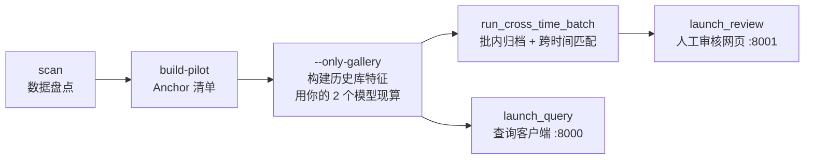

## 一、现状盘点

| 资产 | 状态 | 用途 |
|---|---|---|
| `models/detectors/yolov8n_dorsalfin.pt` | ✅ 已有 | YOLO 背鳍检测器（E1） |
| `outputs/metric_learning/r4/best.pt` | ✅ 已有 | r4 特征模型（正式特征源，E5.2） |
| `src_dataset/`（9 批次 1040 张） | ✅ 已有 | 原始数据 |
| `outputs/index/dataset_manifest.csv` | ❌ 需生成 | 数据清单（第 1 步） |
| `outputs/pilot/pilot_set.csv` | ❌ 需生成 | Anchor 清单（第 2 步） |
| `outputs/embeddings/embeddings_metric_r4_yolocrop_v2.*` | ❌ 需生成 | 历史库特征（第 2 步，要用你的 r4 权重 + YOLO 现跑） |

---

## 二、跑通路径总览（依赖关系）



---

## 三、分步执行（全部在仓库根目录跑）

### 第 0 步：装依赖

```bash
pip install -r requirements.txt
python -m pytest tests/ -v        # 可选：先跑一遍 43 个测试，确认环境 OK
```

### 第 1 步：数据盘点（产物：manifest）

```bash
python scripts/prepare_data.py scan
python scripts/prepare_data.py build-pilot
```

- 产出 `outputs/index/dataset_manifest.csv` + `outputs/pilot/pilot_set.csv`
- 验证：打印的统计应接近"9 批次 / 1040 张 / 75 个体 / 322 散图"
- 秒级完成，无需 GPU

### 第 2 步：构建历史库特征（用你的模型现算，需要 GPU）

```bash
python scripts/run_cross_time_batch.py --only-gallery
```

- 做三件事：历史库（20140806 01/03 的 202 张 labeled）→ **YOLO 检测裁剪**（`models/detectors/yolov8n_dorsalfin.pt`）→ **r4 特征**（`outputs/metric_learning/r4/best.pt`）
- 产出 `outputs/embeddings/embeddings_metric_r4_yolocrop_v2.npy` + `_meta.csv`，以及 `outputs/crops_yolo_gallery/` 裁剪图
- ⏱ 202 张图，RTX 4060 上约 5–15 分钟
- **无 GPU 的话**：先手动改 `src/whitewhale/pipeline/cross_time.py:96` 的 `det_device="cuda"` 为 `"cpu"`（会很慢，仅应急）

### 第 3 步：跑批内归档管线（正式流程核心，需要 GPU）

```bash
# 先只跑一个批次试水（推荐）：20140419 02
python scripts/run_cross_time_batch.py --sessions "20140419 02" --skip-gallery
```

- `--skip-gallery` 跳过重建历史库（复用第 2 步产物）
- 产出 `outputs/cluster_archival/cross_time/20140419 02/` 下：`clusters.csv`（逐图）、`cluster_matches.csv`（簇级）、`representatives/`（代表图）、`summary.json`
- 想看更直观的效果，可加 `--sheets` 生成候选簇拼图（当前命令 `run_cross_time_batch.py` 内部 `sheets=True` 已默认开启）
- 全部 7 个新批次都跑：去掉 `--sessions` 参数即可

### 第 4 步：人工审核网页（打开浏览器看结果）

```bash
python scripts/launch_review.py \
  --clusters outputs/cluster_archival/cross_time/20140419\ 02/clusters.csv \
  --batch-embeddings outputs/cluster_archival/cross_time/20140419\ 02/embeddings.npy
```

- 打开 http://127.0.0.1:8001，逐簇点"确认 / 不确定 / 拒绝"
- 审核结果即时写入 `outputs/review/review_annotations.csv`
- 看完可以 `--export` 导出确认个体表

### 第 5 步：个体查询客户端（"这只见过没"）

```bash
python scripts/launch_query.py
```

- 打开 http://127.0.0.1:8000，上传一张背鳍照片 → Top-K 检索 + 三态判定
- ⚠️ ~~历史坑（已修复）~~：`launch_query.py` / `run_pipeline.py` / `evaluate.py` 默认值已统一为 `embeddings_metric_r4_yolocrop_v2.*`（与第 2 步 `--only-gallery` 产物同名），不再需要复制或显式传参。

---

## 四、三个容易踩的坑

1. **v2 命名不一致**（上面已讲）：`run_pipeline.py`、`launch_query.py`、`evaluate.py` 默认读不带 v2 的文件，`cross_time.py` 生成的是 v2。跑前要么复制、要么显式传参。

2. **默认 `det_device="cuda"`**：`cross_time.py:96` 写死 GPU。你有 NVIDIA 卡就直接跑；没有就先改成 `"cpu"`。

3. **launch_review 默认读错路径**：它默认读 `outputs/clusters/clusters.csv`，但管线产物实际在 `outputs/cluster_archival/cross_time/<批次>/clusters.csv`，所以必须显式 `--clusters` 指定（第 4 步已写好）。

---

## 五、如果想更快感受全流程（跳过重计算）

如果暂时不想花十几分钟跑检测+特征，可以：
1. 只做第 1 步（scan + build-pilot，秒级）
2. 跑 `python scripts/evaluate.py --mode pairs` 会因缺特征报错，所以跳过
3. 直接进入第 3 步的 `run_cross_time_batch --sessions ... --skip-gallery`——但这也依赖第 2 步的特征，**绕不过去**，历史库特征是全链路的前置

> 真正绕不开的只有"历史库特征"这一步，它是所有下游（归档、查询、评估）的地基。